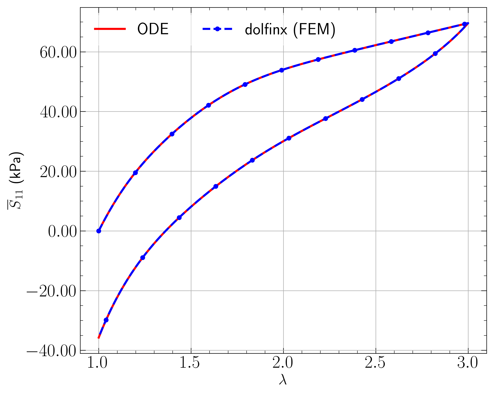
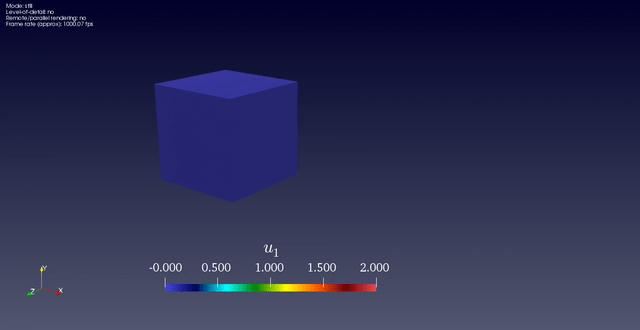

# FEniCS_Shrimali_Ghosh_Kumar_Lopez-Pamies
FEniCS code describing the numerical implementation of a finite viscoelastic model (Non Gaussian rubber with nonlinear viscosity).
Check out our recent publication incorporating a Neo-Hookean version (with constant viscosity) of this above model in
a homogenization setting: http://pamies.cee.illinois.edu/Publications_files/JElast2021.pdf

<p style="text-align:center;"></p><p style="text-align:center;"></p>

## Model validation
Above is a schematic of a finite element calculation for a uniaxial loading of a unit cube with transverse surfaces traction free.

The main file [`src/viscoFEM.py`](src/viscoFEM.py) contains all the functions with corresponding docstrings. An updated version (ported to `dolfinx`) is available at [`src/viscoFEM_dolfinx.py`](src/viscoFEM_dolfinx.py)

## Citation (bib)
```
@article{shrimali2021nonlinear,
    title={The nonlinear viscoelastic response of suspensions of vacuous bubbles in rubber: I—Gaussian rubber with constant viscosity},
    author={Shrimali, Bhavesh and Ghosh, Kamalendu and Lopez-Pamies, Oscar},
    journal={Journal of Elasticity},
    pages={1--30},
    year={2021},
    publisher={Springer}
}
```

```
@article{ghosh2021nonlinear,
  title={The nonlinear viscoelastic response of suspensions of rigid inclusions in rubber: I—Gaussian rubber with constant viscosity},
  author={Ghosh, Kamalendu and Shrimali, Bhavesh and Kumar, Aditya and Lopez-Pamies, Oscar},
  journal={Journal of the Mechanics and Physics of Solids},
  volume={154},
  pages={104544},
  year={2021},
  publisher={Elsevier}
}
```

```
@article{kumar2016two,
  title={On the two-potential constitutive modeling of rubber viscoelastic materials},
  author={Kumar, Aditya and Lopez-Pamies, Oscar},
  journal={Comptes Rendus Mecanique},
  volume={344},
  number={2},
  pages={102--112},
  year={2016},
  publisher={Elsevier}
}
```
